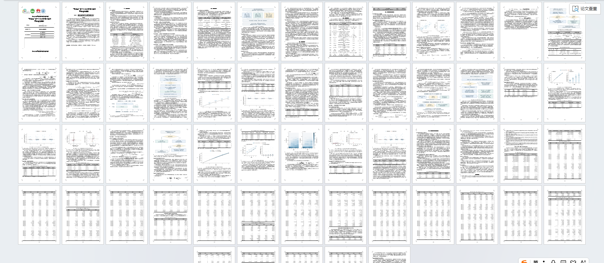
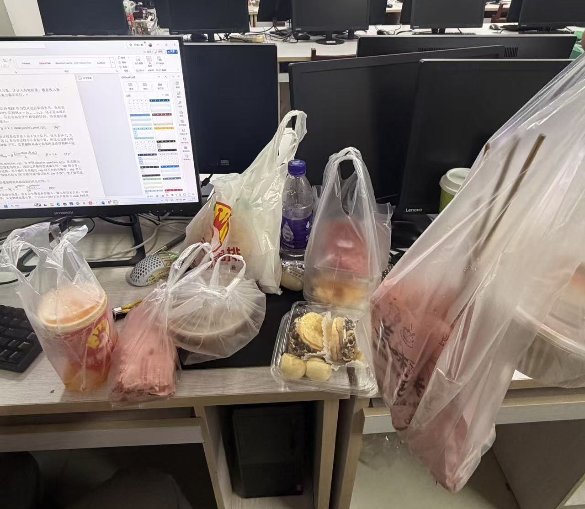
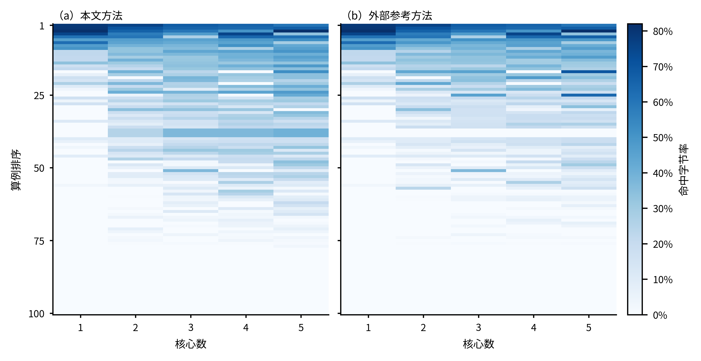

​	还记得上一次数学建模是在大二的时候，当时参加高教社数学建模自己啥也不会，抱着试一试的态度和队友一起捣鼓了三天（虽然自己没出什么力，也没干什么活，但好在我队友比较有实力，直接躺赢了

​	这一次数学建模依旧是在刚入学的时候，难道新生打数学建模是什么传统吗？

​	刚开始选题的时候由于担心plus额度不足以支撑做完这个比赛，于是我研究了一套协同方法，虽然比不上大佬的那些直接在桌面端用网页版的chat进行work，但是也算是比较好用的了，将事先准备好的两套prompt分别喂给GPT和Codex，然后由GPT进行决策，Codex进行执行。

​	GPT分析完赛题以后会直接总结出来一个需要交给Codex决策的prompt，直接粘贴给Codex即可；同样的Codex执行完以后也会返回一个prompt去交给GPT决策，也算是实现了半自动化交互。

​	或许是由于我的节点不稳定，也有可能是由于我的CPU不是很好，反正总之我同学用我分享给他的prompt跑出来了正确的答案，但是我跑出来的数据只有他一半的效果，但是由于时间确实不是很够用了，我只能换上pro20x的账号进行大力出奇迹了：彻底的放权给Codex

​	这样确实是有一个好处，我只用了一晚上就完整的解决了三问，效果虽然只能说中规中矩，但是也足够了，比我之前那个跑了一天一夜的效果要强一些。

​	在得到实验数据以后，依旧是由我的两个队友进行实验绘图，多亏了他们夜以继日的努力，三天熬夜，不断修改，我们的论文终于诞生了。

PS：

​	虽然我什么都不会，什么活都没干好，虽然我把我队友改了一下午一晚上还没保存的论文给关了，虽然我把我两个队友改好的格式给弄乱了，但我的队友还是非常给力的，他们不仅没有打死我，还总会进行一些神秘的养猪仪式

OK了，多的也不说了，接下来专业一点的地方我也不是很懂，没办法通过全人工进行讲解了（AI万岁）

​	先说一下我们选的 A 题，全名叫《通用神经网络处理器下的多核调度问题》。这个名字看着挺唬人的，里面又是神经网络，又是处理器，但是把那些专业名词拆开以后，其实可以理解成：**现在有一堆前后有关联的活，还有几个能干活的核心，我们要安排它们怎么分工，才能尽快全部干完。**

​	这里的“活”就是计算操作，比如矩阵运算、向量运算；操作需要用到的数据叫 Tensor，也就是张量。题目把这些操作和数据之间的关系画成了一张计算图，相当于提前告诉我们：谁要用谁的结果，哪些可以同时做，哪些必须等前面做完。

​	比如先算 A，再拿 A 的结果分别算 B 和 C，最后把 B、C 的结果交给 D。那么 B 和 C 有机会分给两个核心同时做，但 D 就只能老老实实等着。你就算给 D 单独配一个核心，它该等还是得等，并不会因为有了专属工位就凭空算出答案。

​	而且，分工还有成本。

​	一个核心算出来的数据，如果要交给另一个核心用，就需要搬运。大家还共享一条通往 DDR，也就是核外主存的数据通道，不能每个人都当自己有一条专线。核心里面虽然有速度更快的缓存，但是地方有限，放不下的时候还得把数据搬出去，后面用到再搬回来。

​	所以这个题最折磨人的地方就在于：切得太碎，大家确实都有活干了，但是可能光顾着搬数据和等别人；合得太大，搬运少了，又可能变成一个核心忙到起飞，其他核心集体围观。

​	我们要做的就是在这些事情之间找一个比较合适的平衡。

​	具体交给程序的答案，其实就两件事：每个计算操作属于哪个子图，以及这些子图分别放在哪个核心、按什么顺序执行。子图可以理解成我们打包好的一组工作。题目已经提供了核内调度和多核评估程序，我们把分工方案交进去，它再按照规定的依赖、带宽、缓存和等待规则算出最后的成绩。

​	这个成绩主要看 Makespan，也就是整张计算图全部执行完需要多少个时钟周期。它不是我电脑上 Python 跑了多少秒，这两个时间得分开（电脑风扇转得越响，不代表算法成绩越好）。

​	然后三问的区别，主要在于干活的规则不一样。

​	第一问比较严格，一个子图就是一个独立任务。跨子图的数据都得经过 DDR 中转，哪怕前后两个子图分在同一个核心上也一样，而且任务切换和跨核依赖还会带来等待。所以不能简单觉得“把相关的东西全塞到同一个核心上，就没有通信成本了”。

​	第二问放宽了一些：同一个核心上的所有子图合成一个任务，前面留下的数据，后面有机会直接从核内缓存里接着用。但缓存容量还是有限，不是放进去就能永久保存。跨核心传数据，也仍然需要搬运和同步。

​	第三问在第二问的基础上，又给所有核心加了一个共享的只读 L2 缓存。可以把它理解成一个公共取货点：大家反复需要同一份数据时，如果那里已经有了，就有机会少走一次 DDR。它的容量、带宽和先进先出的替换规则都是题目规定好的，我们要研究的是这个条件下怎么安排，以及它到底带来了多少收益。

​	至于我们具体怎么干的，过程也没有“把题目扔给 AI，然后它直接悟出最优解”这么神奇。

​	前面先做了比较简单的基线方案，让整个流程跑通，再尝试调整切分和分核。后来引入了一个外部参考框架，论文里叫 CTP，全称是连续拓扑分区与优先级调度方法。参考框架是借鉴来的，我们是在它的基础上做了两项机制改进。附上一张我画的改进对比热力图（虽然我看不懂，但我个人感觉还是挺好看的）

​	CTP 大致是先把操作排成一个不违反依赖关系的顺序，再沿着这个顺序分组，并考虑组与组之间的数据联系和工作量。排好组以后，再给它们分配执行优先级和核心。

​	我们最后保留的第一项改进叫 M1，主要用在第一问。

​	它解决的是“这一组活到底要干多久”的估计问题。一个核心内部也分不同的计算和搬运单元，有些工作满足条件时可以重叠执行，有些工作必须排队，还有些必须等前面的数据。因此，不能只看这一组有多少操作，也不能直接把所有操作的时间加起来，就认为是它真正的执行时间。

​	M1 会把这些内部依赖和不同单元的忙闲关系考虑进去，再结合串行工作量和估计的搬运成本，给每个子图算一个用于安排任务的时长。最终版本在串行工作量与内部并行估计之间做了折中，参数固定以后再去跑正式测试。

​	说得直白一点，就是先把“这活大概有多费时间”估得更细一些，再拿这个估计去排队。

​	第二项改进叫 M2，主要用在第二问。

​	第二问可以在同一个核心内部接着用数据，因此安排任务时，更值得关心的是：**我要的数据什么时候能用，我要占的计算单元什么时候有空，这份数据放在这个核心上有没有机会复用。**

​	M2 会把一个待安排的子图分别试放到各个核心上，估计计算、读数据、写数据这些环节能怎么衔接，然后选估计完成得最早的位置。这里的“试放”是我们自己的快速估计，并不是每安排一步就调用官方评估器，把所有答案跑一遍再挑最好的。

​	这些估计也不可能把真实执行过程全部还原。共享带宽竞争、缓存换入换出等细节，最后仍然要交给官方评估程序判断，不能自己估出来快了，就宣布优化成功。

​	我们也试过把两项机制一起打开，但组合起来并没有稳定地比单独使用更好，所以最终第一问用 M1，第二问用 M2。

​	第三问则沿用第二问的同一套调度方案，分别在没有 L2 和有 L2 的条件下评估。这样才能分清楚，到底是调度方案变了，还是缓存本身带来了收益。这一问没有再额外发明一个新的缓存替换算法。

​	题目给的 100 张计算图都完成了对应的正式测试。下面是最终方法在不同核数下，相对题目固定单核基准的平均加速比。每个数都是先对每张图算加速比，再取平均：

| 场景          | 2 核  | 3 核  | 4 核  | 5 核  |
| ------------- | ----- | ----- | ----- | ----- |
| 第一问        | 1.667 | 2.202 | 2.665 | 3.145 |
| 第二问        | 1.585 | 2.142 | 2.665 | 3.098 |
| 第三问，有 L2 | 1.603 | 2.169 | 2.702 | 3.150 |

​	也就是说，五核时，这套方案在三个场景下的平均加速比都在 3.1 左右。五个核心没有直接变成五倍速度，前面说的数据依赖、搬运和资源竞争，都会影响最后的效果。

​	但这里有一个非常容易把自己夸过头的地方：**相对单核有三倍左右的加速，不代表我们新增的那两个机制带来了三倍提升。**

​	如果和已经比较强的 CTP 参考方法比较，在每问的 100 张图、2～5 核共 400 个配置上，我们的方法逐配置平均耗时降幅分别约为：

- 第一问：0.11%。
- 第二问：1.67%。
- 第三问有 L2：1.68%，这里双方都开启 L2。

​	所以前面说效果中规中矩，五核的平均加速比甚至比参考方法略低一点；第二、三问的平均改善更明显一些，但也远没有到全面碾压的程度。

​	而且平均变好，不代表每个用例都变好。第二问的 400 个配置里，有 128 个更快、189 个持平，还有 83 个反而变慢了。退化结果也得留着，不能因为它不符合“优化成功”的剧情就假装没看见。

​	L2 的收益也需要单独算。固定我们第二问的方案，在五核时，有 L2 相对没有 L2 的逐图平均加速比约为 1.0204。100 张图里，51 张变快、48 张不变，另有 1 张略微变慢。缓存确实有用，但加了缓存也没有直接起飞。

​	实验里还有一个挺有意思的现象：搬得少，不一定跑得快。

​	比如第二问的 `case_002`，四核时，我们的方法把额外搬运量从 15360 bytes 增加到了 36864 bytes，但官方执行时间反而从 94830 cycles 降到了 69554 cycles。至少在这个例子里，多搬一些数据和更短的完成时间是同时发生的，不能只盯着搬运量一个指标判断方案好坏。

​	所以这次“大力出奇迹”带来的结果，就是在已有参考框架上，借助 Codex 完成了两项改进，把三问的方案、测试和结果整理成了一套能复现的东西。有改善，也有没改善的地方，有些改动看着很有道理，实际一跑还会倒退。

​	AI 确实帮忙干了很多活，但是最后能写进论文里的，还是那些实际跑出来、能够对上代码和结果的数据。至于“看起来应该会更好”，只能先让它看起来了（程序并不会因为你很努力就多给两分）。

​	最后在结尾再次感谢我队友对我的不离不弃，没把我打死
