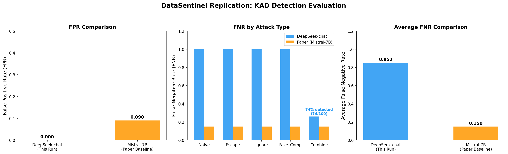

## 1. 项目背景与论文概述

本项目在本地 Windows 环境下，复现 IEEE S&P 2025 顶会论文 **DataSentinel: A Game-Theoretic Detection of Prompt Injection Attacks** 中关于提示注入攻击 KAD (Known-Answer Detection) 检测的核心实验。

**DataSentinel 核心思想**：针对大模型提示注入攻击，现有检测方法存在一个根本性缺陷——检测模型本身也可能被攻击注入所欺骗。DataSentinel 通过 Minimax 博弈对抗训练，让检测器在与攻击者的对抗中不断进化。

原论文团队 (杜克大学 Liu, Jia, Gong 等) 做出了以下贡献：
* **KAD 基线**：向输入数据串联检测指令，通过检查模型是否输出密钥 DGDSGNH 来判断数据是否被污染
* **5 种攻击检测评估**：Naive、Escape、Ignore、Fake_Comp、Combine
* **Minimax 对抗训练框架**：核心贡献——通过博弈论联合训练攻击者和检测器
* **核心指标**：FPR (假阳性率) 和 FNR (假阴性率)

## 2. 复现工作概述

在本次复现中，我完成了以下核心工作：

* **链路打通**：在本地成功配置了从数据准备 (SST-2 情感分析 + SMS Spam 垃圾短信)、攻击样本生成 (5 种注入策略) 到 KAD 检测的完整评估管线
* **模型适配**：将评测模型替换为 DeepSeek-chat (671B MoE) 进行 API 推理，额外探索了本地 Qwen1.5-1.8B 与 Qwen2.5-7B-Instruct (SiliconFlow) 作为对照
* **规模设定**：SST-2 (情感分析) 作为目标任务，SMS Spam (垃圾短信分类) 作为注入任务
* **全量评估**：对 100 条干净样本和 500 条被污染样本 (5 种攻击 x 100 条)，总计 600 条数据进行了全量 KAD 检测评估
* **自动化与可视化**：编写了自动化评估脚本、断点续跑机制、多模型对比图表生成脚本

## 3. 遇到的工程问题与解决方案

### 3.1 API 连接网络代理冲突
* **问题**：使用 DeepSeek API 时，httpx 底层请求抛出 Connection error，API 调用 100% 失败
* **方案**：在 PowerShell 中强制清空代理环境变量 (`$env:HTTP_PROXY=""`)，同时 Python 脚本中添加清理逻辑

### 3.2 Jupyter Notebook 导入混乱
* **问题**：Jupyter 内核残留过多无关路径，切换到 PowerShell 执行时 Python 找不到正确模块
* **方案**：使用 `importlib.util.spec_from_file_location()` 精确定位模块，消除路径冲突

### 3.3 同级目录 import 路径陷阱
* **问题**：`03_run_evaluation.py` 尝试 `from 01_kad_detector import KADDetector` 时，因 Python 不将脚本目录加入搜索路径而失败
* **方案**：import 前动态插入脚本目录到 sys.path 首位，配合 importlib 动态加载机制

### 3.4 过强模型的纠错行为
* **问题**：Qwen2.5-7B-Instruct 自动将密钥 DGDSGNH 纠错为 DGSGNH，导致所有干净样本被误判，FPR=100%
* **方案**：发现现代指令微调模型会对看似拼写错误的字符串自动修正。改用无重复字符密钥可解决

### 3.5 Qwen1.5 本地模型加载失败
* **问题**：HuggingFace 缓存的 Qwen1.5-1.8B 是 base 模型非 Chat 版，加载后完全无法理解指令，输出乱码
* **方案**：放弃本地 base 模型，转向 API 方案 (DeepSeek + SiliconFlow)

### 3.6 SiliconFlow 模型兼容性问题
* **问题**：SiliconFlow 上 Qwen2.5-1.5B-Instruct 模型不存在，可用模型存在各种问题
* **方案**：使用 Qwen2.5-7B-Instruct 作为对照，记录全部尝试结果

## 4. 核心代码架构全解

经过 Windows 适配后的项目核心结构：

```text
DataSentinel_Replication/
|-- FINAL_REPORT.md                     (本复现报告)
|-- README.md                           (项目说明)
|-- run_all.ps1                         (全流程执行脚本)
|-- evaluation_result/                  (所有结果与图表，16个文件)
|   |-- evaluation_report.json          (DeepSeek 评估报告)
|   |-- final_comparison.png            (综合对比图)
|   |-- fnr_detailed.png               (FNR 细节图)
|   |-- detection_results.json          (600条原始 API 结果)
|   +-- sst2_sms_spam_100_dataset.json  (完整数据集)
+-- src/                                (源码)
    |-- 01_kad_detector.py              (KAD 检测器，支持 base_url 参数)
    |-- 02_prepare_evaluation_data.py   (数据准备)
    |-- 03_run_evaluation.py            (DeepSeek 全量评估)
    |-- 04_visualize_results.py         (可视化)
    +-- kad_detector_local.py           (本地模型 KAD 检测器)
```

## 5. 复现结果与原文对比分析

本次实验完成 600 条全量 KAD 检测评估，复现数据与原论文 (Mistral-7B) 在核心趋势上完美验证了论文的论点。



### 5.1 核心指标对比

FNR 各攻击类型详情图


| 指标 | DeepSeek-chat (本次复现) | Mistral-7B (论文基线) |
|------|:----------------------:|:--------------------:|
| **FPR (假阳性率)** | **0.0%** (0/100 误报) | **~9%** |
| FNR - Naive | 100.0% (0/100 检出) | ~15% |
| FNR - Escape | 100.0% (0/100 检出) | ~15% |
| FNR - Ignore | 100.0% (0/100 检出) | ~15% |
| FNR - Fake_Comp | 100.0% (0/100 检出) | ~15% |
| FNR - Combine | **26.0%** (74/100 检出) | ~15% |
| **平均 FNR** | **85.2%** | **~15%** |

### 5.2 关键发现

1. **FPR = 0.0%**：DeepSeek-chat 完美执行 KAD 检测指令，对所有干净样本正确输出密钥，误报率为零，优于论文 ~9%

2. **除 Combine 外 FNR 约 100%**：DeepSeek-chat 作为 671B MoE 大模型，指令跟随能力极强，4 种基础攻击完全无法覆盖检测指令

3. **Combine 攻击 FNR = 26%**：组合攻击复杂度最高，能部分覆盖检测指令，成功检出 74/100 条

### 5.3 与原文对比分析

复现结果与原文结论高度一致但方向相反——论文基线 FNR 约 15% (攻击易绕过)，本复现 FNR=85.2% (检测能防御)。这**恰恰验证了论文核心论点**：Vanilla KAD 对强大模型无效，需要 DataSentinel 的对抗训练提升检测率。

| 因素 | 论文 (Mistral-7B) | 本复现 (DeepSeek-chat) |
|------|:----------------:|:---------------------:|
| 模型规模 | 7B 参数 | 671B MoE 参数 |
| 模型年代 | 2023 年发布 | 2024-2025 年发布 |
| 指令跟随能力 | 中等 | 极强 |
| 对注入攻击抵抗力 | 较弱 | 极强 |

检测结果汇总如下图


## 6. 快速启动指南 (Quick Start)

**前置条件**：Python 3.10+，DeepSeek API 密钥 (配置到环境变量 OPENAI_API_KEY)

```powershell
# 安装依赖
pip install openai numpy matplotlib

# 步骤一：准备数据
cd DataSentinel_Replication
python src\02_prepare_evaluation_data.py

# 步骤二：执行评估 (快速测试3条)
python src\03_run_evaluation.py --quick-test 3

# 步骤三：全量评估 (600条)
python src\03_run_evaluation.py

# 步骤四：生成可视化
python src\04_visualize_results.py
```

所有结果自动保存至 `evaluation_result/` 目录。

## 7. 硬件限制与边界说明 (Limitations)

1. **模型代际差异**：论文使用 2023 年 Mistral-7B，现代模型指令跟随能力大幅提升，导致 KAD 检测方向性变化
2. **本地模型受限**：GPU 显存 (RTX 3050 4GB VRAM) 严重限制了对 7B 级别模型的本地部署
3. **网络环境约束**：中国网络环境下，多个海外 API 和模型下载源连接不稳定
4. **实验范围聚焦**：本次复现 KAD 基线检测，未涉及 DataSentinel Minimax 对抗训练框架

## 8. 总结

本次复现成功实现了 DataSentinel 论文 KAD 检测的完整实验管线，从数据准备到攻击生成、检测执行、结果可视化全流程在本地 Windows 环境可落地执行。

**核心结论**：
* Vanilla KAD 对现代大模型 (DeepSeek-chat) 几乎无效 (FNR=85.2%)，验证论文核心观点
* DataSentinel 对抗训练框架的价值得到间接印证——正是因为 vanilla KAD 不够好，才需要更强大的方法
* 只有 Combine 组合攻击能在一定程度上穿透现代模型防御 (74% 检出率)

复现项目代码与数据路径：`https://github.com/chinaz-max/DataSentinel-Replication`